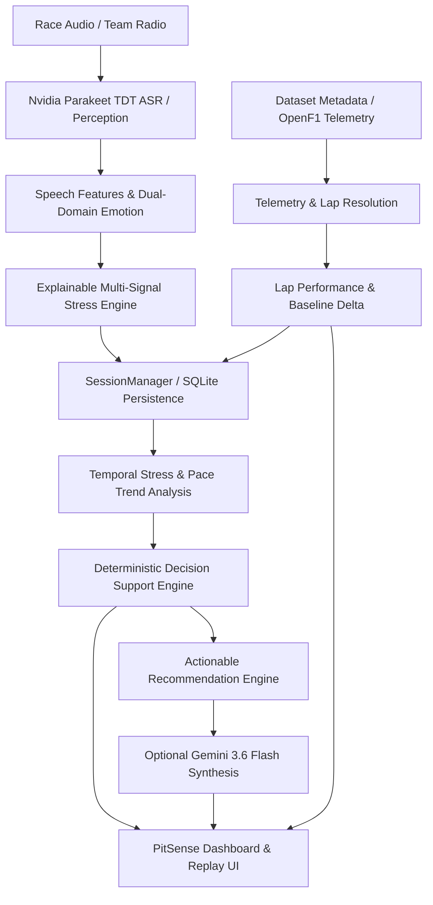

# PitSense

> **Engineering-Focused Motorsport Intelligence & Race-Engineering Decision-Support System**

PitSense processes race-radio audio signals and unifies them with telemetry and lap-performance context. By combining speech perception, multi-signal stress scoring, multi-lap temporal trend analysis, and an authoritative deterministic decision engine, PitSense transforms unstructured driver communications into structured operational intelligence for the pit wall.

---

## Overview

Motorsport race engineers must interpret compressed, high-stress driver radio messages in real time under extreme time pressure.
- **Radio audio alone** lacks objective performance data—a driver sounding anxious may still be setting personal best sector times.
- **Telemetry alone** lacks human context—a drop in speed could be tactical lift-and-coast or an unvoiced driver physical struggle.

PitSense bridges this gap by unifying raw race-radio audio perception, driver-stress classification, OpenF1 dataset telemetry matching, multi-lap temporal analysis, and a rule-based decision support engine into a real-time engineering dashboard.

> **Positioning & Operational Boundaries**
> PitSense is a **decision-support tool** for race engineers. It does **not** autonomously control race cars, does **not** provide safety-critical certification, and does **not** claim medical-grade emotion detection. All engineering recommendations are strictly derived from observable acoustic, textual, and telemetry signals.

---

## Core Pipeline



### Pipeline Sequence
1. **Perception**: Audio is transcribed via Nvidia Parakeet TDT ASR (`nvidia/parakeet-tdt-0.6b-v3`). Acoustic features (pitch, energy, tempo) and text emotions are extracted.
2. **Stress Inference**: Multi-signal scoring engine computes a transparent `stress_index` (0–100) and driver state (`CALM`, `ELEVATED`, `STRESSED`, `CRITICAL`).
3. **Telemetry Resolution**: Filenames are matched against dataset metadata (`metadata.csv` & `openf1_extended.json`) to resolve lap number, lap time, sector split times, and trap speeds.
4. **Temporal Accumulation**: Observations are recorded into SQLite (`SessionManager`) to build multi-lap trend histories and calculate stress/pace Pearson correlations.
5. **Deterministic Decision**: Evaluates rules *before* natural-language generation to output authoritative severities (`CRITICAL`, `STRESSED`, `ELEVATED`, `CALM`) and decisions (`PIT_AND_INSPECT`, `RADIO_INTERVENTION`, `MONITOR`, etc.).
6. **AI Synthesis**: Optional Gemini 3.6 Flash layer formulates concise pit-wall replies grounded in the deterministic decision engine context.

---

## Current Architecture

| Component | Responsibility | Primary File(s) |
| --- | --- | --- |
| **FastAPI Core** | REST API endpoints (`/upload`, `/health`, `/simulation/*`, `/dataset/validate`, `/chat`, `/session/reset`), static file mounting, CORS middleware. | `backend/app.py` |
| **ASR & Audio Perception** | High-speed speech transcription (`nvidia/parakeet-tdt-0.6b-v3`), acoustic feature extraction (pitch/energy/tempo), and speech emotion classification (`wav2vec2-lg-xlsr-en-speech-emotion-recognition`). | `backend/ai/asr_model.py`<br>`backend/ai/speech_features.py`<br>`backend/ai/audio_emotion.py` |
| **Text Emotion & Driver State** | Text-domain emotion classification (`j-hartmann/emotion-english-distilroberta-base`), vehicle issue extraction (tyres, brakes, vibration, balance), and urgency rating. | `backend/ai/emotion_model.py`<br>`backend/ai/driver_state.py` |
| **Explainable Stress Engine** | Multi-signal weighted scoring combining audio emotion confidence, acoustic pitch/energy variance, text emotion, and driver issue keywords into a 0–100 `stress_index`. | `backend/ai/stress_engine.py` |
| **Telemetry Dataset Loader** | OpenF1 dataset loader matching radio filenames against metadata to resolve lap times, sector splits, speed traps, pit status, and radio timestamps. | `backend/dataset_loader.py` |
| **Telemetry Contract** | Normalises time-series telemetry data across multi-observation sessions and computes session-wide data availability states. | `backend/telemetry_contract.py` |
| **Temporal Analysis Engine** | Tracks multi-lap stress trends, baseline pace deltas, Pearson correlation coefficients, non-causal association statements, and temporal confidence caps. | `backend/ai/temporal_analysis.py` |
| **Deterministic Decision Engine** | Authoritative rule-based decision support system generating severity, priority, decision, explainable reasons, and evidence structures. | `backend/ai/decision_engine.py` |
| **Actionable Recommendations** | Strategic pit-wall recommendation generator combining driver state, stress trends, and lap performance. | `backend/ai/recommendation_engine.py` |
| **AI Synthesis & Fallback Layer** | Formulates pit-wall summaries and interactive Q&A replies using Gemini 3.6 Flash. Gracefully falls back to local rule-based synthesis if API key is missing. | `backend/ai/race_engineer.py`<br>`backend/ai/llm_summary.py` |
| **SQLite Persistence Layer** | WAL-mode SQLite database maintaining durable session history, lap trends, and active session state across Uvicorn backend restarts. | `backend/database/db.py` |
| **Race Simulation Engine** | Dynamic discovery of dataset samples, simulation audio serving, and step-by-step race session replay. | `backend/dataset_loader.py` |
| **Frontend Dashboard** | React 19 + Vite dashboard featuring live radio upload/recording, telemetry cards, Chart.js session graphs, decision cards, and simulation controls. | `frontend/src/pages/Dashboard.jsx`<br>`frontend/src/components/dashboard/` |

---

## Project Structure

```text
PitSense/
├── backend/
│   ├── ai/
│   │   ├── asr_model.py           # Nvidia Parakeet TDT ASR
│   │   ├── audio_emotion.py       # Audio domain speech emotion model
│   │   ├── decision_engine.py     # Deterministic Engineer Decision Engine
│   │   ├── driver_state.py        # Driver state classification
│   │   ├── emotion_model.py       # Text domain emotion model (DistilRoBERTa)
│   │   ├── llm_summary.py         # Gemini synthesis (REST, no SDK required)
│   │   ├── race_engineer.py       # Grounded Q&A & summary engine
│   │   ├── recommendation_engine.py # Strategic actionable insights
│   │   ├── speech_features.py     # Acoustic signal processing
│   │   ├── stress_engine.py       # Explainable multi-signal stress engine
│   │   ├── temporal_analysis.py   # Temporal & Pearson correlation engine
│   │   └── temporal_engine.py     # Lap performance helpers
│   ├── database/
│   │   └── db.py                  # SQLite WAL persistence layer
│   ├── app.py                     # FastAPI backend server & endpoints
│   ├── dataset_loader.py          # OpenF1 dataset metadata loader
│   ├── telemetry_contract.py      # Telemetry series normalisation
│   ├── requirements.txt
│   ├── test_dataset_pipeline.py
│   ├── test_phase7_8.py
│   ├── test_phase9_persistence.py
│   ├── test_phase9_simulation.py
│   ├── test_phase10_hardening.py
│   ├── test_telemetry.py
│   └── test_telemetry_contract.py
├── dataset/
│   ├── audio/                     # Frozen F1 radio audio samples (.mp3)
│   ├── metadata.csv               # Lap timing & OpenF1 telemetry metadata
│   ├── openf1_extended.json       # Extended sector & speed trap data
│   └── download_dataset.py        # Dataset ingestion pipeline (not for submission)
├── frontend/
│   ├── src/
│   │   ├── components/
│   │   │   ├── dashboard/         # AISummary, DecisionCard, TelemetryCard,
│   │   │   │                      # PerformanceGraph, SimulationControls, etc.
│   │   │   ├── engineer/          # EngineerChat
│   │   │   └── upload/            # UploadCard
│   │   ├── pages/
│   │   │   └── Dashboard.jsx      # Main Race Intelligence Dashboard
│   │   ├── services/api.js
│   │   └── utils/sessions.js
│   └── package.json
└── README.md
```

---

## Telemetry System

Telemetry in PitSense is linked directly to race-radio audio recordings to provide objective performance context.

### Telemetry Architecture & Matching Strategy
- **Dataset Structure**: `dataset/metadata.csv` contains 250 metadata records (189 `TELEMETRY_LINKED` and 61 `RADIO_ONLY`). `dataset/openf1_extended.json` contains extended sector and speed trap data. `dataset/audio/` contains 157 frozen MP3 audio samples.
- **Lookup Strategy**: `get_telemetry_for_file(filename)` performs lowercased exact matching against dataset audio filenames.
- **Matching Methods**: Metadata records preserve OpenF1 alignment strategy (`interval` matching: 184 rows, `nearest` matching: 6 rows, `unavailable`: 60 rows).
- **Graceful Unmatched State**: If an uploaded audio file has no matching telemetry record, PitSense returns `{"available": False}` without failing the perception or decision pipeline.
- **Metadata Preservation & Idempotency**: Dataset metadata loading is read-only and idempotent. First-seen records take precedence on duplicates.

### Exposed Telemetry Fields
```json
{
  "available": true,
  "lap": 4,
  "lap_time": 99.170,
  "sector_1": 29.464,
  "sector_2": 42.067,
  "sector_3": 27.639,
  "i1_speed": 286,
  "i2_speed": 258,
  "top_speed": 284,
  "is_pit_out_lap": false,
  "radio_time": "2024-09-22T12:09:14.327000+00:00",
  "audio_file": "lap_04.mp3"
}
```

---

## Live Telemetry & Graphs

The PitSense frontend provides dynamic telemetry visualization using Chart.js:

- **Stress Over Laps**: Line chart rendering driver stress trend (`stress_index`) across accumulated session observations.
- **Lap Time vs Baseline**: Time-series chart tracking lap times against baseline performance.
- **Sector Splits & Speed Traps**: Real-time display of Sector 1/2/3 durations and Intermediate 1, Intermediate 2, and Speed Trap velocities.
- **Honest Data Quality Status**: Graphs render status indicators (`AVAILABLE`, `PARTIAL`, `INSUFFICIENT`, `UNAVAILABLE`) based on actual data completeness rather than fabricating missing telemetry points.

---

## AI & Perception Pipeline

PitSense strictly decouples **perception** and **deterministic decision-making** from **generative explanation**:

1. **Audio Perception**: `nvidia/parakeet-tdt-0.6b-v3` converts speech to text. `speech_features.py` computes pitch/energy/tempo variance. `audio_emotion.py` estimates acoustic emotion confidence.
2. **Text Analysis**: DistilRoBERTa (`j-hartmann/emotion-english-distilroberta-base`) classifies text emotion and detects driver concern keywords (e.g. tyre vibration, brake fade, engine smoke).
3. **Multi-Signal Stress Scoring**: Combines acoustic features, speech emotion, text emotion, and issue keywords into a 0–100 `stress_index`.
4. **Deterministic Decision Engine**: Executes rule-based decision trees *prior* to any LLM invocation.
5. **Generative Explanation**: Gemini 3.6 Flash generates natural-language summaries and pit-wall replies based on the deterministic engine's structured outputs. If the Gemini API is unreachable or `GEMINI_API_KEY` is not set, PitSense falls back to local deterministic rule-based replies.

---

## Temporal Analysis

PitSense maintains temporal context across multi-lap sessions using `SessionManager`:

- **Sample Count**: Tracks total radio observations in the active session.
- **Stress Trend**: Classifies multi-lap stress progression (`RISING`, `FALLING`, `STABLE`).
- **Pace Trend & Direction**: Evaluates lap times relative to baseline (`SLOWER`, `FASTER`, `STABLE`).
- **Pearson Correlation**: Computes correlation between driver stress and lap times when ≥ 3 paired data points exist.
- **Non-Causal Association**: Formulates observable association statements (e.g., *"Observing elevated stress alongside +0.45s lap time degradation across 4 laps"*).
- **Confidence Caps**: Single-observation sessions cap decision confidence at ≤ 0.55. Correlation is marked `INSUFFICIENT` until 3 paired samples are available.

---

## Decision Engine

The **Deterministic Race Engineer Decision Engine** (`backend/ai/decision_engine.py`) operates authoritatively:

### Severity & Priority Levels
- **`CRITICAL` / `CRITICAL`**: Stress ≥ 85, Emergency state, or critical vehicle issue with pace degradation.
- **`STRESSED` / `HIGH`**: Sustained stress ≥ 65, or rising stress combined with slower lap times.
- **`ELEVATED` / `MODERATE`**: Stress between 45–64 or slight pace drop.
- **`CALM` / `LOW`**: Low stress (≤ 44), normal communication, stable pace.

### Decision Vocabulary
- `PIT_AND_INSPECT`: Box immediately for critical vehicle inspection/tyre change.
- `RADIO_INTERVENTION`: Contact driver immediately to verify status or strategy.
- `CHECK_VEHICLE`: Monitor telemetry diagnostic channels for reported vehicle anomaly.
- `CHECK_DRIVER`: Maintain radio check and monitor sector pace.
- `MONITOR_PERFORMANCE`: Monitor lap time degradation on upcoming sector splits.
- `MONITOR`: Continue standard stint monitoring.
- `NO_ACTION`: Maintain current stint plan.

---

## Data Quality Model

PitSense enforces explicit 4-state data quality mapping across all evidence outputs:

- **`AVAILABLE`**: Complete telemetry and sufficient session history (≥ 3 paired samples for correlation).
- **`PARTIAL`**: Telemetry present but missing specific fields (e.g. lap time present, sector times missing).
- **`INSUFFICIENT`**: Telemetry present, but sample count (< 3) is too small for statistical correlation.
- **`UNAVAILABLE`**: Telemetry missing, unmatched audio, or transcript unavailable.

Missing telemetry explicitly reduces overall confidence rather than silently substituting fake data.

---

## Persistence & Session Management

Session state is persisted using a WAL-mode SQLite database (`backend/database/db.py`):

- **Database Location**: `backend/data/pitsense.db` (overrideable via `PITSENSE_DB_PATH`).
- **Tables**: `sessions` (active session tracking) and `temporal_observations` (ordered observation history, stress metrics, telemetry JSON, driver issues).
- **Restart Resilience**: Backend restarts preserve session history, stress trends, active session IDs, and correlation calculations.
- **Reset Operations**: Endpoint `POST /session/reset` clears individual or all persistent sessions.

---

## Simulation Mode

PitSense includes a Race Simulation Mode for automated session replay:

- **Dataset Sample Discovery**: Dynamically scans `dataset/metadata.csv` and `dataset/audio/` to build a chronological playback sequence.
- **Endpoints**: `GET /simulation/samples` lists samples; `GET /simulation/audio/{filename}` streams audio files.
- **Replay Controls**: UI provides `START`, `PAUSE`, `NEXT`, and `RESET` simulation controls.

---

## Dataset

The PitSense dataset contains frozen OpenF1 telemetry and team radio samples:

- **Metadata**: 250 rows in `dataset/metadata.csv` (189 `TELEMETRY_LINKED`, 61 `RADIO_ONLY`).
- **Audio Files**: 157 `.mp3` audio recordings in `dataset/audio/`.
- **Extended Data**: 5 extended sector/speed trap records in `dataset/openf1_extended.json`.
- **Validation**: Endpoint `GET /dataset/validate` verifies dataset loader integrity against benchmark laps (`lap_04.mp3`, `lap_33.mp3`, `lap_44.mp3`, `lap_47.mp3`, `lap_52.mp3`).

---

## API Reference

| Endpoint | Method | Purpose | Key Parameters / Body |
| --- | --- | --- | --- |
| `/` | `GET` | Backend home check | None |
| `/health` / `/status` | `GET` | Truthful component readiness & status (`READY`, `DEGRADED`, `UNAVAILABLE`) | None |
| `/dataset/validate` | `GET` | Validates benchmark lap telemetry loading | None |
| `/simulation/samples` | `GET` | Returns list of discovered simulation samples | None |
| `/simulation/audio/{filename}` | `GET` | Serves simulation audio file | `filename` (path param) |
| `/upload` | `POST` | Main audio perception, temporal analysis & decision pipeline | `file` (multipart/form-data), `session_id`, `lap`, `lap_time_seconds` |
| `/session/reset` | `POST` | Resets specific or all session histories | `session_id` (query param) |
| `/chat` | `POST` | Interactive Race Engineer Q&A | `ChatRequest` JSON (`question`, `transcript`, `telemetry`, etc.) |

---

## Frontend Dashboard

The frontend dashboard (`frontend/src/pages/Dashboard.jsx`) provides a dark-mode pit-wall interface:

- **Upload & Live Recording**: Drag-and-drop audio file upload or live browser microphone recording.
- **Driver State & Emotion Card**: Displays stress index gauge, urgency rating, primary emotion, and acoustic feature indicators.
- **Transcript Card**: Displays transcribed driver radio speech.
- **Telemetry Card & Performance Graph**: Displays real-time telemetry metrics, sector split times, speed traps, and Chart.js trend graphs.
- **Decision Support Card**: Displays authoritative decision, severity badge, evidence reasons, and 4-state data quality badges.
- **Race Engineer AI Chat**: Interactive chat interface for querying strategy and session context.
- **Simulation Controls Bar**: Floating simulation playback bar with progress tracker.

---

## Testing

The PitSense backend includes a comprehensive, automated pytest suite covering dataset loaders, temporal analysis, decision logic, SQLite persistence, simulation endpoints, telemetry series contracts, and API hardening.

### Test Execution Command

**On Windows:**
```powershell
.\backend\.venv\Scripts\python.exe -m pytest backend -v
```

**On Linux/macOS:**
```bash
backend/.venv/bin/python -m pytest backend -v
```

### Test Suite Status: 53 tests collected

| File | Tests |
| --- | --- |
| `backend/test_dataset_pipeline.py` | 8 |
| `backend/test_phase7_8.py` | 10 |
| `backend/test_phase9_persistence.py` | 13 |
| `backend/test_phase9_simulation.py` | 11 |
| `backend/test_phase10_hardening.py` | 6 |
| `backend/test_telemetry.py` | 2 |
| `backend/test_telemetry_contract.py` | 3 |
| **Total** | **53** |

> **Note**: One non-fatal `StarletteDeprecationWarning` is emitted on import of `fastapi.testclient`. This does not affect test results and will be resolved when `httpx2` is adopted upstream.

---

## Tech Stack

| Domain | Technologies |
| --- | --- |
| **Backend** | Python 3.10+, FastAPI, Uvicorn, SQLite3 (WAL mode), Pydantic |
| **ML / AI / Perception** | PyTorch, HuggingFace Transformers, `nvidia/parakeet-tdt-0.6b-v3` (ASR), `ehcalabres/wav2vec2-lg-xlsr-en-speech-emotion-recognition` (Audio Emotion), `j-hartmann/emotion-english-distilroberta-base` (Text Emotion), Google Gemini 3.6 Flash (via REST API) |
| **Audio Processing** | SoundFile, NumPy, FFmpeg |
| **Frontend** | React 19, Vite 8, Tailwind CSS v4, Chart.js, Lucide React Icons, Axios |
| **Testing** | pytest 9.1+, FastAPI TestClient, httpx |

---

## Local Setup & Execution

### Prerequisites
- Python 3.10+
- Node.js 18+
- FFmpeg installed and available in system PATH.

### 1. Set Up & Run Backend

```bash
cd backend
python -m venv .venv

# On Windows PowerShell:
.\.venv\Scripts\Activate.ps1
# On Linux/macOS:
source .venv/bin/activate

pip install -r requirements.txt
python -m uvicorn app:app --reload --port 8000
```

### 2. Set Up & Run Frontend

```bash
cd frontend
npm install
npm run dev
```

Open `http://localhost:5173` in your browser.

### 3. Run Backend Test Suite

```bash
# From repository root:
.\backend\.venv\Scripts\python.exe -m pytest backend -v
```

---

## Environment Variables

Copy `backend/.env.example` to `backend/.env` and configure:

```env
# Optional: Gemini API key for natural-language synthesis.
# If omitted or invalid, PitSense automatically uses local deterministic replies.
GEMINI_API_KEY=your_gemini_api_key_here
GEMINI_MODEL=gemini-3.6-flash

# Optional overrides (defaults work without setting these):
# PITSENSE_DB_PATH=/path/to/pitsense.db
# DATASET_METADATA_PATH=/path/to/metadata.csv
# DATASET_EXTENDED_PATH=/path/to/openf1_extended.json
```

---

## Engineering Design Principles

1. **Evidence Before Explanation**: Deterministic decision trees evaluate acoustic, textual, and telemetry signals before triggering natural-language summaries.
2. **Explicit Uncertainty**: Data completeness is mapped to explicit states (`AVAILABLE`, `PARTIAL`, `INSUFFICIENT`, `UNAVAILABLE`) rather than fabricating missing metrics.
3. **Graceful Degradation**: Missing API keys or telemetry mismatches fall back smoothly to local synthesis and `available=False` states without crashing.
4. **Temporal Context Over Isolated Signals**: Evaluates multi-lap stress trends and pace deltas rather than treating every radio message in isolation.
5. **Durable Session State**: Persists session observations in SQLite to survive server restarts.

---

## Limitations

- **Dataset Scope**: Currently backed by a frozen dataset of 250 metadata rows and 157 audio recordings.
- **Audio Noise**: High acoustic engine/wind noise in race radio audio can impact ASR and speech emotion inference.
- **Correlation Bounds**: Pearson correlation requires ≥ 3 paired lap observations; earlier observations report `INSUFFICIENT` correlation.
- **Non-Causal Association**: Stress and pace correlations reflect mathematical co-occurrence rather than proven causality.
- **Simulated Environment**: The current system processes pre-recorded and uploaded audio; it is not a live streaming pipeline.

---

## Project Status

PitSense is fully implemented, verified, and hardened:
- ✅ **Perception & Stress Engine**: Nvidia Parakeet TDT ASR, Dual-Domain Emotion, Speech Acoustics.
- ✅ **Telemetry Integration**: OpenF1 dataset loader, lap matching, sector splits, speed traps.
- ✅ **Temporal Reasoning**: Multi-lap stress trends, baseline pace deltas, Pearson correlation.
- ✅ **Deterministic Decision Support**: Authoritative severity, decision, and evidence generation.
- ✅ **SQLite Persistence**: Durable session storage surviving server restarts.
- ✅ **Simulation Replay Mode**: Automated session discovery and step-by-step playback.
- ✅ **Dynamic Visualization**: Live telemetry cards, status indicators, Chart.js session graphs.
- ✅ **53-test Suite**: Automated pytest suite across 7 test files.

---

## License & Author

Developed for PitSense AI Race Engineering.
Author: Abhinav Gupta
