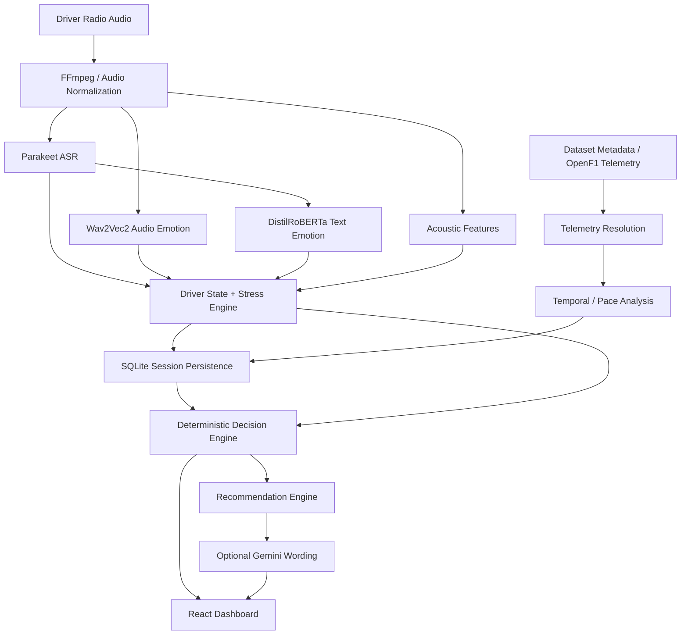

# 🏎️ PitSense

> **Engineering-Focused Motorsport Intelligence & Race-Engineering Decision-Support System**

PitSense transforms driver race-radio communication into structured race-engineering intelligence by combining speech recognition, audio and text emotion analysis, acoustic features, explainable stress scoring, telemetry context, temporal analysis, deterministic decisions, and an optional AI wording layer.

> **Positioning:** PitSense is a hackathon/research decision-support prototype. It does not autonomously control a vehicle, provide safety-critical certification, or claim medical-grade emotion detection.

---

## 🎯 What Problem Does PitSense Solve?

Race engineers have to process two very different information streams at the same time:

- **What the driver says** — complaints, observations, urgency, confidence and reported problems.
- **What the car is doing** — pace, sectors, speed, telemetry and trends.

Radio alone lacks objective performance context. Telemetry alone lacks human context.

PitSense attempts to bridge the two:

```text
Driver Radio
     ↓
Audio Preprocessing
     ↓
┌──────────────┬───────────────┬────────────────┐
│     ASR      │ Audio Emotion │ Acoustic Signal│
│   Parakeet   │   Wav2Vec2    │ RMS / ZCR / F0 │
└──────────────┴───────────────┴────────────────┘
     ↓
Text Emotion
(DistilRoBERTa)
     ↓
Driver State + Stress
     ↓
Telemetry / Lap Context
     ↓
Temporal Analysis
     ↓
Deterministic Decision Engine
     ↓
Recommendation
     ↓
Optional Gemini Wording Layer
     ↓
AI Race Engineer / Dashboard
```

The core design principle is **separation of perception, decision and language**. ML models detect signals; PitSense's deterministic intelligence interprets them; Gemini is an optional wording layer rather than the sole decision-maker.

---

## ✨ Current Features

### 🎙️ Driver Radio Intelligence
- Audio file upload
- Drag-and-drop audio input
- Browser microphone recording
- Speech-to-text with NVIDIA Parakeet TDT
- Transcript generation and presentation
- Audio preprocessing through FFmpeg
- Acoustic signal analysis

### 🧠 Multimodal Emotion & Driver-State Analysis
- Audio emotion recognition using Wav2Vec2
- Text emotion recognition using DistilRoBERTa
- Confidence scores
- Acoustic features including pitch, RMS energy, ZCR and non-silence ratio
- Explainable stress index from 0–100
- Driver state classification
- Issue/keyword detection
- Urgency and confidence signals

### 🏁 Deterministic Race Decision Support
The decision engine produces structured outputs including:
- Severity
- Priority
- Decision code
- Evidence
- Confidence
- Pit-wall action
- Recommendations

Possible actions include monitoring, vehicle checks, driver intervention and pit/inspect recommendations depending on the evidence available.

### 📡 Dataset-Backed Telemetry
For recordings whose filenames match supplied metadata, PitSense can resolve:
- Lap number
- Lap time
- Sector times
- Speed traps
- Pit status
- Radio timestamp
- Pace context

When telemetry cannot be matched, PitSense reports it as unavailable rather than inventing telemetry.

### 📈 Temporal Intelligence
SQLite-backed session history supports:
- Stress trends
- Pace changes
- Lap-performance deltas
- Multi-observation history
- Pearson stress/pace correlation when enough paired observations exist
- Persistent session restoration

### 🎮 Simulation / Replay
The supplied dataset can be replayed chronologically to demonstrate the complete intelligence pipeline without connecting a physical race car.

### 💬 AI Race Engineer
- Session-aware race-engineer Q&A
- Structured engineering context
- Optional Gemini natural-language synthesis
- Local deterministic fallback when Gemini is unavailable

### 🗂️ Session History
- Session persistence
- Switching between sessions
- Search
- Rename
- Delete
- Restore previous analyses
- Session-specific engineer chat

### 🖥️ Motorsport Dashboard
The dashboard brings together:
- AI race-engineer summary
- Driver state
- Stress/emotion indicators
- Transcript/radio command
- Recommendations
- Telemetry
- Performance visualization
- Race-style metrics
- Simulation controls
- Engineer interaction

### 🛠️ Backend Control Center
PitSense also contains a local backend admin/control center for inspecting:
- Backend state
- Model status
- Sessions
- Diagnostics
- API health

The control center is currently intended for local/hackathon use and is not a production-authenticated administration system.

---

## 🤖 AI Models

| Component | Model | Purpose |
|---|---|---|
| Speech-to-Text | `nvidia/parakeet-tdt-0.6b-v3` | Driver radio transcription |
| Audio Emotion | `ehcalabres/wav2vec2-lg-xlsr-en-speech-emotion-recognition` | Voice emotion characteristics |
| Text Emotion | `j-hartmann/emotion-english-distilroberta-base` | Transcript emotion classification |
| Natural-language layer | `gemini-3.6-flash` (optional) | Human-readable race-engineer responses |

The Hugging Face models are downloaded and cached locally. A Hugging Face API token is not required for normal inference.

Gemini is optional. If it is unavailable, the core deterministic intelligence remains operational.

---

## 🧠 Custom PitSense Intelligence

### Acoustic Feature Extraction
The audio pipeline extracts indicators such as:
- Pitch mean/variance
- RMS energy behaviour
- Zero-crossing rate
- Non-silence ratio

### Explainable Stress Engine
PitSense combines available audio, acoustic, transcript and motorsport-domain signals into a bounded stress index.

When a signal is unavailable, the system can re-normalize the remaining valid signals instead of fabricating missing evidence.

### Driver State
The system maps combined signals into operational states such as:
`Calm`, `Confident`, `Alert`, `Concerned`, `Fatigued`, `Frustrated`, `Emergency`.

### Telemetry Contract
`dataset_loader.py` and `telemetry_contract.py` provide a normalized telemetry layer so future live data sources can feed the same downstream intelligence system.

### Temporal Analysis
Session observations are persisted in SQLite. When sufficient paired observations exist, PitSense calculates Pearson correlation between stress and lap-time delta and presents it as an **association**, not a causal claim.

### Decision Engine
The deterministic engine converts evidence into structured engineering decisions before any LLM wording occurs.

### Recommendation Engine
The recommendation layer converts decisions into clear pit-wall actions and supporting rationale.

---

## 📊 Data Truth: What Is Real?

Transparency matters for the hackathon demo.

| Component | Current implementation |
|---|---|
| ASR transcript | **Real model inference** |
| Audio emotion | **Real model inference** |
| Text emotion | **Real model inference** |
| Acoustic features | **Calculated from audio** |
| Stress index | **Calculated from multiple signals** |
| Driver state | **Deterministic/rule-based interpretation** |
| Race decision | **Deterministic/rule-based** |
| Recommendation | **Deterministic/rule-based** |
| Dataset telemetry | **Real supplied dataset-backed data** |
| Temporal correlation | **Calculated** |
| Simulation | **Dataset replay / simulated workflow** |
| Gemini response wording | **Optional cloud-generated language** |
| Some dashboard cockpit metrics | **Presentation/demo values** |

### About the hardcoded dashboard metrics

The current dashboard intentionally retains some presentation/demo values such as fuel, tyre condition, gap and race metrics so the cockpit-style UI remains visually complete during a hackathon demonstration.

These values are **not direct ECU, OBD-II or CAN telemetry**.

They are acceptable for the current presentation/demo scope, but should be replaced or explicitly marked as simulated once live vehicle integration is implemented.

---

## 📊 Dataset

The current demonstration dataset contains supplied driver-radio recordings and OpenF1-derived telemetry context.

- `dataset/metadata.csv` — radio/telemetry metadata
- `dataset/openf1_extended.json` — extended sector/speed-trap information
- `dataset/audio/` — supplied radio samples
- `backend/data/pitsense.db` — runtime SQLite database
- `backend/uploads/` — temporary uploaded audio processing directory

The dataset is primarily intended for reproducible demonstration and development of the intelligence pipeline.

---

## 🏛️ Architecture



The modular separation makes future data sources and models replaceable without rewriting the whole system.

---

## 🚧 Current Limitations & Known Flaws

PitSense is functional, but it is **not yet a production race-engineering platform**. The following limitations are known and intentionally documented rather than hidden.

### 1. No direct live vehicle integration
The current release does not directly read:
- OBD-II
- CAN bus
- ECU streams
- Motorsport-specific telemetry hardware
- Live fuel sensors
- Live tyre sensors

Telemetry is currently dataset-backed or unavailable for unmatched recordings.

### 2. Dashboard cockpit values are partly presentation-driven
Some values shown in the cockpit-style dashboard are hardcoded/demo presentation values. They should not be confused with live car telemetry.

### 3. No complete live race feed
The current system does not yet ingest a complete live feed containing all of:
- GPS
- Race position
- Competitor gaps
- Weather
- Live timing
- Live tyre data
- Full race-control information

### 4. Voice interaction is not yet a complete two-way loop
Microphone recording exists, but PitSense does not yet provide a complete low-latency conversational loop where a driver continuously speaks and the AI race engineer immediately speaks back.

### 5. Inference is currently CPU-oriented
The setup deliberately supports CPU execution for portability. On modest hardware, model inference can introduce noticeable latency. GPU acceleration and streaming inference would be required for a serious real-time deployment.

### 6. Emotion detection is probabilistic
Audio/text emotion models are not objective measurements of a driver's mental or medical state. They should be treated as contextual signals rather than ground truth.

### 7. Deterministic rules need motorsport validation
The decision engine is explainable and deterministic, but production deployment would require extensive validation against real racing scenarios, vehicle classes, drivers, teams and race strategies.

### 8. Admin/control-center security is not production-grade
The current admin interface is intended for local/hackathon use. A production deployment would require authentication, authorization, restricted CORS, secure secrets handling, audit logging and hardened network exposure.

### 9. Gemini remains an external dependency when enabled
Although the core system has a local fallback, Gemini requires network connectivity and an API key when used.

### 10. Streaming architecture is still an upgrade path
The current pipeline is optimized around uploaded recordings, sessions and reproducible simulation. A true live implementation needs streaming audio buffers, incremental ASR, event-driven telemetry ingestion and low-latency state updates.

### 11. Some repository structure can be cleaned further
There are legacy/placeholder route modules and other areas that can be consolidated as the project moves beyond hackathon development. They do not prevent the current application from operating.

---

## 🧪 Testing

The backend contains automated tests covering:
- Dataset loading
- Telemetry matching
- Telemetry contract normalization
- Perception/decision components
- SQLite persistence
- Simulation
- API hardening

The documented verified suite contains **53 passing tests across 7 test files**.

Run the backend tests with:

### Windows
```powershell
.\backend\.venv\Scripts\python.exe -m pytest backend -v
```

### Linux/macOS
```bash
backend/.venv/bin/python -m pytest backend -v
```

Before submission, the recommended validation sequence is:

```text
Fresh environment
      ↓
Install dependencies
      ↓
Download models
      ↓
Run tests
      ↓
Start backend
      ↓
Start frontend
      ↓
Perform end-to-end audio analysis
      ↓
Verify telemetry / unavailable states
      ↓
Verify session history
      ↓
Verify engineer chat
      ↓
Verify Gemini fallback
```

---

# 🚀 Future Upgrade Path

PitSense is deliberately designed so the current **radio → intelligence → decision** core can evolve into a much broader multimodal race-engineering platform.

## Phase 1 — Conversational Race Engineer

### 🔊 Text-to-Speech
Convert AI race-engineer responses into spoken radio-style output.

```text
Driver Radio
    ↓
PitSense Intelligence
    ↓
Race Engineer Response
    ↓
Text-to-Speech
    ↓
Spoken Response
```

### 🗣️ Live Two-Way Voice
Move from upload-based analysis to:

```text
Driver speaks
    ↓
Streaming ASR
    ↓
Emotion + Driver State
    ↓
Race Intelligence
    ↓
Decision Engine
    ↓
LLM wording
    ↓
TTS
    ↓
Race Engineer speaks back
```

Potential additions:
- Push-to-talk
- Wake-word activation
- Streaming ASR
- Interruptible responses
- Low-latency voice synthesis

---

## Phase 2 — Live Vehicle Telemetry

### OBD-II Adapter
Depending on the vehicle and exposed PIDs, possible signals include:
- RPM
- Vehicle speed
- Throttle position
- Engine load
- Coolant temperature
- Battery voltage
- Diagnostic trouble codes
- Fuel information where available

### CAN-Bus Adapter
A motorsport-oriented CAN adapter could expose richer signals such as:
- Wheel speeds
- Steering angle
- Brake pressure
- Gear
- Engine telemetry
- Temperatures
- Suspension data
- Tyre information
- Energy/hybrid-system data

The actual available signals depend on the vehicle, ECU, CAN database and hardware.

The intended architecture is:

```text
OBD / CAN / ECU / Sensors
          ↓
   Telemetry Adapter
          ↓
   PitSense Telemetry Contract
          ↓
 Existing Intelligence Engine
```

This means live hardware should be added as a **new input adapter**, not by rewriting the decision engine.

---

## Phase 3 — Full Multimodal Race Context

Add:
- GPS
- Live timing
- Race position
- Competitor gaps
- Weather
- Track conditions
- Tyre compound/state
- Pit-lane status
- Race-control events

Long-term architecture:

```text
Driver Radio ───────┐
Vehicle Telemetry ──┤
GPS ────────────────┤
Timing ─────────────┤
Weather ────────────┤
Tyre Data ──────────┤
Race Position ──────┤
Competitor Gaps ────┘
          ↓
   PIT SENSE ENGINE
          ↓
Driver State + Vehicle State + Strategy
          ↓
      AI Race Engineer
```

---

## Phase 4 — Fuel & Race Strategy Intelligence

Potential future capabilities:
- Live fuel estimation
- Fuel consumption rate
- Laps remaining
- Fuel-saving recommendations
- Pit-window prediction
- Tyre degradation prediction
- Undercut/overcut analysis
- Traffic-aware strategy
- Race-position-aware strategy
- Stint optimization

Example future output:

> “At the current consumption rate, approximately X laps remain. Staying out for two laps is projected to improve the pit-window outcome.”

These capabilities are **future scope**, not current functionality.

---

## Phase 5 — Vehicle Diagnostics

Integrate ECU diagnostic information with driver radio.

Example concept:

```text
ECU / OBD
    ↓
Diagnostic Code
    ↓
PitSense Diagnostic Interpreter
    ↓
Driver + Vehicle Context
    ↓
Recommended Engineering Action
```

For example, a future implementation could combine a diagnostic fault with the driver's radio report and current telemetry before suggesting an inspection.

Any real-world diagnostic recommendation would require automotive validation and safety safeguards.

---

## Phase 6 — Predictive Intelligence

Once enough real telemetry and race data exist, future ML systems could target:
- Tyre degradation prediction
- Fuel prediction
- Mechanical anomaly detection
- Predictive maintenance
- Race outcome prediction
- Strategy simulation
- Opponent behaviour analysis
- Driver performance modelling
- Strategy optimization
- Reinforcement-learning experiments

The current deterministic engine should remain the explainable safety/control layer while predictive models provide additional evidence.

---

## Phase 7 — Hardware / Edge Deployment

Long-term deployment could move the system from a laptop demonstration to an edge-compute device inside a race engineering environment.

```text
Race Car
   ↓
ECU / CAN / OBD / Sensors
   ↓
Edge Telemetry Gateway
   ↓
PitSense Intelligence Engine
   ↓
Decision Support
   ↓
Dashboard + Voice
   ↓
Driver / Race Engineer
```

Potential engineering work:
- GPU/NPU acceleration
- Quantized models
- Streaming inference
- Async event processing
- Hardware watchdogs
- Offline-first operation
- Telemetry buffering
- Fault-tolerant networking

---

## 🧱 Why PitSense Is Upgradeable

The system is separated into modules for:

- AI perception
- Acoustic processing
- Driver-state interpretation
- Stress calculation
- Telemetry normalization
- Temporal analysis
- Decision support
- Recommendation generation
- Natural-language synthesis
- Session persistence
- Frontend presentation

This makes future additions naturally fit as adapters or modules:

```text
CURRENT
Radio → AI → Decision

NEXT
Radio + Telemetry → AI → Decision

LATER
Radio + Telemetry + GPS + Weather + Timing → Strategy

LONG TERM
Car → PitSense → Intelligence → Decision → Driver
```

---

## 🔐 Security & Production Hardening Roadmap

Before production deployment, PitSense should add:

- Admin authentication
- Role-based authorization
- Restricted CORS
- Secure secret management
- HTTPS/TLS
- API rate limiting
- Upload size/type restrictions
- Stronger request validation
- Audit logging
- Model integrity/version tracking
- Database backup/recovery
- Secure telemetry transport
- Device authentication
- Network isolation for vehicle-facing components

The current configuration is suitable for local development and hackathon demonstration, not safety-critical deployment.

---

## 🛠️ Installation

### Windows automated setup

```powershell
git clone https://github.com/abhinavg138/PitSense.git
cd PitSense
Set-ExecutionPolicy -Scope Process Bypass
.\setup.ps1
```

The setup script creates the Python environment, installs CPU-compatible PyTorch and backend dependencies, downloads the local models and prepares the environment file.

### Backend

```powershell
cd backend
..\.venv\Scripts\python.exe -m uvicorn app:app --reload --port 8000
```

### Frontend

```powershell
cd frontend
npm install
npm run dev
```

Normally the frontend is available at `http://localhost:5173` and the backend at `http://localhost:8000`.

### Environment

Create `backend/.env`:

```env
GEMINI_API_KEY=your_gemini_api_key_here
GEMINI_MODEL=gemini-3.6-flash
```

Never commit real API keys.

---

## 🔌 Current API Surface

| Method | Endpoint | Purpose |
|---|---|---|
| `GET` | `/` | Backend/control-center entry point |
| `GET` | `/admin/` | Control center UI |
| `GET` | `/health` | Health check |
| `GET` | `/status` | Component status |
| `GET` | `/admin/api/overview` | Admin overview data |
| `GET` | `/dataset/validate` | Dataset validation |
| `GET` | `/simulation/samples` | Simulation samples |
| `GET` | `/simulation/audio/{filename}` | Serve simulation audio |
| `POST` | `/upload` | Analyze radio audio |
| `POST` | `/session/reset` | Reset session |
| `POST` | `/chat` | Race-engineer Q&A |

This represents the current implementation and is not yet a production API contract.

---

## 📂 Project Structure

```text
PitSense/
├── backend/
│   ├── ai/                    # ASR, emotion, stress, decision & engineer logic
│   ├── database/              # SQLite persistence
│   ├── admin/                 # Backend control center
│   ├── data/                  # Runtime database
│   ├── uploads/               # Temporary audio processing
│   ├── app.py                 # FastAPI application
│   ├── dataset_loader.py      # Dataset/telemetry resolution
│   ├── telemetry_contract.py  # Normalized telemetry contract
│   ├── setup_models.py        # Local model downloader
│   ├── requirements.txt       # Backend dependencies
│   └── test_*.py              # Backend test suite
├── dataset/                   # Audio + telemetry dataset
├── docs/                      # Architecture/demo assets
├── frontend/                  # React/Vite dashboard
├── .env.example
├── .gitignore
├── setup.ps1
├── setup_models.py
└── README.md
```

---

## 🏁 Hackathon Demo Positioning

The strongest way to present PitSense is not as “an AI that detects emotion”.

Present it as:

> **An intelligence layer for race engineers that understands what the driver says, how the driver says it, how the driver's condition is changing, and what the available race context suggests should happen next.**

The key story is:

```text
WHAT THE DRIVER SAYS
        +
HOW THE DRIVER SOUNDS
        +
WHAT THE AVAILABLE DATA SAYS
        +
WHAT HAS CHANGED OVER TIME
        ↓
EXPLAINABLE RACE DECISION
        ↓
WHAT TO DO NEXT
```

The goal is not to replace the race engineer.

The goal is to **reduce the race engineer's cognitive load**.

---

## 🛡️ Responsible Use

PitSense is a research/demo decision-support system.

It is **not**:
- A certified motorsport safety system
- An autonomous vehicle controller
- A certified automotive diagnostic platform
- A medical diagnostic system
- A replacement for a professional race engineer

Human experts must validate recommendations before acting on them in real-world environments.

---

## 📌 Current Status

PitSense is currently a functional hackathon/research prototype with:

- Multimodal driver-radio analysis
- Local Hugging Face inference
- Explainable driver-state analysis
- Deterministic race-engineering decisions
- Dataset-backed telemetry correlation
- Temporal session analysis
- Simulation/replay
- Persistent sessions
- Engineer chat
- Optional Gemini synthesis
- Motorsport dashboard
- Backend control center

### Planned — not yet implemented

- Full live OBD-II integration
- CAN-bus / ECU telemetry
- Direct fuel and diagnostic data from a vehicle
- Real-time streaming telemetry
- Full two-way spoken race engineer
- Live weather and race-context ingestion
- Predictive fuel and tyre strategy
- Vehicle anomaly prediction
- Production-grade hardware deployment
- Production authentication/security

The current system intentionally focuses on making the **radio → intelligence → decision-support** loop demonstrable, explainable and extensible before adding hardware and real-time infrastructure.

---

## 📄 License & Author

Developed for PitSense Motorsport Intelligence.

**Author:** Abhinav Gupta  
**Repository:** https://github.com/abhinavg138/PitSense

---

## 🏎️ PitSense

**From driver radio to race intelligence.**
