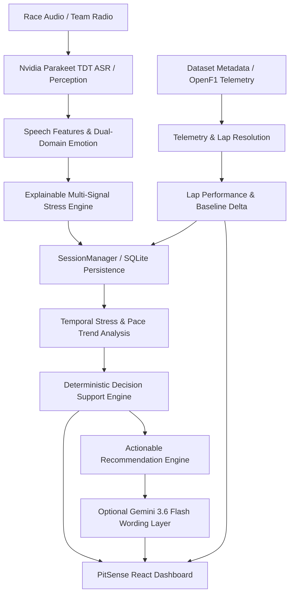

# PitSense

> **Engineering-Focused Motorsport Intelligence & Race-Engineering Decision-Support System**

PitSense processes race-radio audio signals and unifies them with telemetry and lap-performance context. By combining speech perception, multi-signal stress scoring, multi-lap temporal trend analysis, and an authoritative deterministic decision engine, PitSense transforms unstructured driver communications into structured operational intelligence for the pit wall.

---

## ⚡ Quick Start & Installation

Getting PitSense running on a fresh clone is automated via PowerShell on Windows.

### Preferred Windows Installation (`setup.ps1`)

Open PowerShell in the project directory and run:

```powershell
git clone https://github.com/abhinavg138/PitSense.git
cd PitSense
Set-ExecutionPolicy -Scope Process Bypass
.\setup.ps1
```

#### What `setup.ps1` does automatically:
1. **Python Check**: Verifies Python 3.10+ is available in system PATH.
2. **Virtual Environment**: Creates root `.venv` if missing (`python -m venv .venv`).
3. **Pip Upgrade**: Upgrades `pip` inside the virtual environment.
4. **PyTorch Installation**: Installs CPU-compatible PyTorch (`torch`) from PyTorch CPU wheel index (`https://download.pytorch.org/whl/cpu`).
5. **Dependency Installation**: Installs backend Python dependencies from `backend/requirements.txt`.
6. **Local Model Setup**: Runs `setup_models.py` (which delegates to `backend/setup_models.py`) to download and cache the 3 required Hugging Face AI models locally into `backend/models/`.
7. **Environment File Setup**: Creates `backend\.env` from `backend\.env.example` if `backend\.env` does not exist.

---

### Starting PitSense

After setup completes, start the backend and frontend in separate terminals:

#### 1. Start Backend Server (FastAPI / Uvicorn)
```powershell
cd backend
..\.venv\Scripts\python.exe -m uvicorn app:app --reload --port 8000
```
*Backend API will run at `http://localhost:8000` (API documentation at `http://localhost:8000/docs`).*

#### 2. Start Frontend Dashboard (React / Vite)
```bash
cd frontend
npm install
npm run dev
```
*Frontend Dashboard will run at `http://localhost:5173`.*

---

### Manual Installation (Alternative)

If you prefer to set up manually without `setup.ps1`:

#### On Windows:
```powershell
# 1. Clone repository
git clone https://github.com/abhinavg138/PitSense.git
cd PitSense

# 2. Create virtual environment
python -m venv .venv
.\.venv\Scripts\Activate.ps1

# 3. Install CPU-only PyTorch & backend dependencies
python -m pip install --upgrade pip
python -m pip install torch --index-url https://download.pytorch.org/whl/cpu
python -m pip install -r backend/requirements.txt

# 4. Download HF models locally
python setup_models.py

# 5. Configure environment variables
Copy-Item .env.example backend\.env
```

#### On Linux / macOS:
```bash
# 1. Clone repository
git clone https://github.com/abhinavg138/PitSense.git
cd PitSense

# 2. Create virtual environment
python3 -m venv backend/.venv
source backend/.venv/bin/activate

# 3. Install CPU-only PyTorch & backend dependencies
pip install --upgrade pip
pip install torch --index-url https://download.pytorch.org/whl/cpu
pip install -r backend/requirements.txt

# 4. Download HF models locally
python backend/setup_models.py

# 5. Configure environment variables
cp .env.example backend/.env

# 6. Start Backend
cd backend
python -m uvicorn app:app --reload --port 8000
```

---

## 🔑 Environment Variables

PitSense uses environment variables configured in `backend/.env` (or root `.env`).

### `.env` File Setup
Copy `.env.example` to `backend/.env`:

```env
# Optional: Google Gemini API Key for race engineer synthesis
GEMINI_API_KEY=your_gemini_api_key_here

# Optional: Gemini model selection (defaults to gemini-3.6-flash)
GEMINI_MODEL=gemini-3.6-flash
```

> [!IMPORTANT]
> - **No Hugging Face Token Required**: PitSense runs Hugging Face models **locally / offline**. `HF_TOKEN` is **NOT** needed.
> - **Gemini API Key**: `GEMINI_API_KEY` is optional. If provided, Gemini generates natural-language explanations grounded strictly in deterministic decision outputs. If omitted or invalid, PitSense automatically falls back to local deterministic synthesis with zero loss of core functionality.
> - **Secrets Protection**: `.env` files and model weight directories are listed in `.gitignore` and must NEVER be committed to Git.

---

## 🎯 Overview & Problem Statement

Motorsport race engineers must interpret compressed, high-stress driver radio communications under extreme time pressure:
- **Radio audio alone** lacks objective performance data—a driver sounding anxious might still be setting personal best sector times.
- **Telemetry alone** lacks human context—a drop in lap speed could be tactical lift-and-coast or an unvoiced physical vehicle issue.

PitSense unifies raw race-radio audio perception, driver-stress classification, OpenF1 telemetry dataset matching, multi-lap temporal analysis, and an authoritative rule-based decision support engine into a real-time engineering dashboard.

> **Positioning & Operational Boundaries**  
> PitSense is a **decision-support tool** for race engineers. It does **not** autonomously control race cars, does **not** provide safety-critical certification, and does **not** claim medical-grade emotion detection. All engineering recommendations are strictly derived from observable acoustic, textual, and telemetry signals.

---

## 🏛️ Architecture & Pipeline



### Component Roles & Boundaries

1. **Pretrained AI Perception Models** (Local CPU inference):
   - Speech-to-Text transcription via Nvidia Parakeet TDT ASR.
   - Speech Emotion Recognition via Wav2Vec2.
   - Text Emotion Classification via DistilRoBERTa.
2. **PitSense Custom Intelligence**:
   - Acoustic signal processing (pitch, energy, tempo, silence ratio).
   - Multi-signal weighted stress scoring engine (`stress_index` 0–100).
   - Driver state classification (`CALM`, `ELEVATED`, `STRESSED`, `CRITICAL`, etc.).
   - OpenF1 telemetry resolution and telemetry series normalization.
   - Temporal multi-lap trend analysis and Pearson stress/pace correlation.
3. **Deterministic Decision Engine**:
   - Authoritative rule-based decision support system executing *prior* to any natural language generation.
4. **Gemini Wording Layer** (External Cloud API):
   - Optional generative layer that converts deterministic decision outputs into concise radio responses and pit-wall summaries.

---

## 🤖 AI Models

PitSense uses 3 local Hugging Face models and 1 cloud API:

| Model Component | Type / Class | Model ID | Operational Role |
| --- | --- | --- | --- |
| **Speech-to-Text (ASR)** | ASR Model (CTC/TDT) | `nvidia/parakeet-tdt-0.6b-v3` | Transcribes race radio audio into text with 30s chunking. |
| **Audio Emotion** | Audio Classifier (Wav2Vec2) | `ehcalabres/wav2vec2-lg-xlsr-en-speech-emotion-recognition` | Classifies audio emotion probabilities (angry, calm, fearful, etc.) directly from 16kHz mono WAV audio. |
| **Text Emotion** | Text Classifier (DistilRoBERTa) | `j-hartmann/emotion-english-distilroberta-base` | Classifies text emotion probabilities (fear, anger, neutral, etc.) from driver transcript. |
| **Generative LLM** | Cloud LLM (REST API) | `gemini-3.6-flash` | Formulates pit-wall radio summaries and interactive Q&A replies using REST endpoint. |

> [!NOTE]
> `setup_models.py` downloads `parakeet`, `audio_emotion`, and `text_emotion` to `backend/models/` during setup so inference runs 100% locally on CPU without Hugging Face API tokens.

---

## 🧠 Custom PitSense Intelligence

PitSense implements proprietary domain intelligence modules in `backend/ai/`:

### 1. Acoustic Feature Extraction (`speech_features.py`)
Extracts fundamental acoustic indicators from radio WAV files:
- **Pitch (F0) Mean & Variance**: Detects vocal strain and pitch inflection using `librosa.pyin`.
- **RMS Energy Variance**: Quantifies speech loudness dynamics and shouting intensity.
- **Zero-Crossing Rate (ZCR)**: Measures spectral noisiness and voice harshness.
- **Non-Silence Ratio**: Computes speech duty cycle and speech pauses.

### 2. Multi-Signal Stress Engine (`stress_engine.py`)
Computes an explainable 0–100 `stress_index` by fusing four weighted signal streams:
- Audio emotion confidence (fear/anger weighting).
- Acoustic feature variance (pitch jump & energy spikes).
- Text emotion confidence (DistilRoBERTa).
- Driver issue keyword detection (tyre vibration, brake fade, engine temp, balance).

### 3. Driver-State Classification (`driver_state.py`)
Categorizes driver state into 7 operational levels:
`Calm`, `Confident`, `Alert`, `Concerned`, `Fatigued`, `Frustrated`, `Emergency`.

### 4. Telemetry Matching & Telemetry Contract (`dataset_loader.py` & `telemetry_contract.py`)
- Matches uploaded radio audio filenames against dataset metadata (`metadata.csv` and `openf1_extended.json`).
- Resolves lap number, lap time, sector times (S1/S2/S3), speed traps (I1/I2/Top Speed), pit status, and radio timestamp.
- Normalises multi-observation series and calculates session data-availability states.

### 5. Temporal Analysis & Pearson Correlation (`temporal_analysis.py` & `temporal_engine.py`)
- Maintains session multi-lap observation history in SQLite (`SessionManager`).
- Computes **Pearson Correlation Coefficient** ($r$) between driver stress index and lap time deltas when $\ge 3$ paired observations exist.
- Formulates non-causal association statements (e.g., *"Observing elevated stress alongside +0.45s lap degradation across 4 laps"*).

### 6. Deterministic Decision Engine (`decision_engine.py`)
Executes rule-based decision trees to output:
- **Severity Level**: `CRITICAL`, `STRESSED`, `ELEVATED`, `CALM`.
- **Actionable Decision**: `PIT_AND_INSPECT`, `RADIO_INTERVENTION`, `CHECK_VEHICLE`, `CHECK_DRIVER`, `MONITOR_PERFORMANCE`, `MONITOR`, `NO_ACTION`.
- **Evidence Structure**: Quantified explanation list backing the decision.

### 7. Strategic Recommendations (`recommendation_engine.py`)
Generates actionable race-engineering recommendations based on vehicle issues, telemetry deltas, and driver stress trends.

### 8. 4-State Data Quality Model
- **`AVAILABLE`**: Complete telemetry and sufficient history ($\ge 3$ observations).
- **`PARTIAL`**: Telemetry present but specific sector fields missing.
- **`INSUFFICIENT`**: Telemetry present but sample count ($< 3$) too low for correlation.
- **`UNAVAILABLE`**: Unmatched audio or missing telemetry.

### 9. SQLite Session Persistence (`backend/database/db.py`)
WAL-mode SQLite database storing active session states, observation logs, telemetry snapshots, and stress history across server restarts.

---

## 📊 Dataset

PitSense includes a frozen dataset derived from OpenF1 formula telemetry and driver radio recordings:

- **Metadata (`dataset/metadata.csv`)**: 250 records (189 `TELEMETRY_LINKED`, 61 `RADIO_ONLY`).
- **Extended Sector Data (`dataset/openf1_extended.json`)**: Detailed sector split times and speed trap measurements.
- **Audio Files (`dataset/audio/`)**: 157 pre-processed MP3 audio radio samples (`lap_04.mp3`, `lap_33.mp3`, `lap_44.mp3`, `lap_47.mp3`, `lap_52.mp3`, etc.).
- **Runtime Database (`backend/data/pitsense.db`)**: SQLite persistent store generated at runtime.
- **Runtime Uploads (`backend/uploads/`)**: Temporary storage for uploaded user audio files.

---

## 📂 Project Structure

```text
PitSense/
├── backend/
│   ├── ai/
│   │   ├── asr_model.py              # Nvidia Parakeet TDT ASR loader & inference
│   │   ├── audio_emotion.py          # Wav2Vec2 speech emotion classifier
│   │   ├── decision_engine.py        # Deterministic Engineer Decision Engine
│   │   ├── driver_state.py           # Driver state classification
│   │   ├── emotion_model.py          # DistilRoBERTa text emotion classifier
│   │   ├── llm_summary.py            # Gemini 3.6 Flash REST integration & parser
│   │   ├── race_engineer.py          # Grounded race engineer Q&A engine
│   │   ├── recommendation_engine.py  # Strategic actionable insights generator
│   │   ├── speech_features.py        # Acoustic feature extraction (pitch, RMS, ZCR)
│   │   ├── stress_engine.py          # Explainable multi-signal stress engine
│   │   ├── temporal_analysis.py      # Multi-lap temporal trends & Pearson correlation
│   │   └── temporal_engine.py        # Lap performance calculation helpers
│   ├── database/
│   │   ├── db.py                     # SQLite WAL persistence layer
│   │   └── models.py                 # Pydantic & database schema models
│   ├── data/                         # SQLite database storage (pitsense.db)
│   ├── routes/                       # FastAPI endpoint route handlers
│   │   ├── emotion.py
│   │   ├── history.py
│   │   ├── report.py
│   │   ├── transcript.py
│   │   └── upload.py
│   ├── uploads/                      # Uploaded audio file processing directory
│   ├── app.py                        # FastAPI main application & API router
│   ├── dataset_loader.py             # OpenF1 dataset loader & telemetry matcher
│   ├── telemetry_contract.py         # Telemetry series data normaliser
│   ├── setup_models.py               # Downloads HF models to backend/models/
│   ├── requirements.txt              # Backend Python dependencies
│   ├── test_dataset_pipeline.py      # Dataset loader unit tests
│   ├── test_phase7_8.py              # Perception & decision engine tests
│   ├── test_phase9_persistence.py    # SQLite persistence unit tests
│   ├── test_phase9_simulation.py     # Race simulation endpoint tests
│   ├── test_phase10_hardening.py     # API error handling & contract tests
│   ├── test_telemetry.py             # Telemetry matching tests
│   └── test_telemetry_contract.py    # Telemetry series contract tests
├── dataset/
│   ├── audio/                        # 157 frozen MP3 audio samples
│   ├── metadata.csv                  # OpenF1 telemetry & radio metadata
│   ├── openf1_extended.json          # Extended sector split times & speed trap data
│   ├── build_dataset.py              # Dataset build utility
│   ├── download_dataset.py           # Dataset ingestion utility
│   └── README.md                     # Dataset documentation
├── docs/
│   ├── HACKATHON_DEMO.md             # Hackathon presentation guide
│   ├── architecture.png              # Architecture diagram asset
│   └── presentation.pptx             # Project presentation deck
├── frontend/
│   ├── src/
│   │   ├── components/
│   │   │   ├── dashboard/            # AISummary, DecisionCard, TelemetryCard,
│   │   │   │                         # PerformanceGraph, SimulationControls, etc.
│   │   │   ├── engineer/             # EngineerChat
│   │   │   └── upload/               # UploadCard
│   │   ├── pages/
│   │   │   └── Dashboard.jsx         # Main Race Intelligence Dashboard page
│   │   ├── services/
│   │   │   └── api.js                # Frontend API client service
│   │   └── utils/
│   │       └── sessions.js           # Frontend session state helpers
│   ├── package.json                  # Frontend npm dependencies
│   ├── vite.config.js                # Vite build configuration
│   └── README.md                     # Frontend overview
├── .env.example                      # Environment variables template
├── .gitignore                        # Git ignore patterns
├── requirements.txt                  # Root requirements wrapper
├── setup.ps1                         # One-click Windows setup PowerShell script
├── setup_models.py                   # Root model download wrapper
└── README.md                         # Main repository documentation
```

---

## 🧪 Testing

The PitSense backend includes an automated pytest suite covering dataset loaders, perception models, temporal analysis, decision trees, SQLite persistence, simulation endpoints, and API contracts.

### Running Backend Unit Tests

**On Windows:**
```powershell
.\backend\.venv\Scripts\python.exe -m pytest backend -v
```

**On Linux / macOS:**
```bash
backend/.venv/bin/python -m pytest backend -v
```

### Verified Test Suite (53 Passing Tests across 7 Test Files)

| Test File | Verified Test Count | Target Subsystem |
| --- | --- | --- |
| `backend/test_dataset_pipeline.py` | 8 | OpenF1 telemetry loader & benchmark validation |
| `backend/test_phase7_8.py` | 10 | ASR, emotion models & decision engine |
| `backend/test_phase9_persistence.py` | 13 | SQLite WAL storage & session recovery |
| `backend/test_phase9_simulation.py` | 11 | Race simulation discovery & replay API |
| `backend/test_phase10_hardening.py` | 6 | API error handling & data contract edge cases |
| `backend/test_telemetry.py` | 2 | Telemetry lookup & filename matching |
| `backend/test_telemetry_contract.py` | 3 | Telemetry series normalisation & data quality |
| **Total Verified** | **53** | **100% Passing Test Suite** |

---

## 🛠️ Troubleshooting

### 1. Python Not Found (`python is not recognized...`)
- Ensure Python 3.10+ is installed from [python.org](https://www.python.org/).
- Ensure **"Add Python to PATH"** was checked during installation.
- In PowerShell, try running `py --version` or restarting PowerShell.

### 2. PowerShell Script Execution Policy Error
If running `.\setup.ps1` gives an execution policy error, run:
```powershell
Set-ExecutionPolicy -Scope Process Bypass
.\setup.ps1
```

### 3. Missing FFmpeg (`ffmpeg not found...`)
- Parakeet ASR requires FFmpeg to convert audio formats (.mp3, .m4a, .webm) into 16kHz mono WAV.
- **Windows (via Chocolatey or Scoop)**: `choco install ffmpeg` or download from [ffmpeg.org](https://ffmpeg.org/) and add `bin` folder to system PATH.
- **macOS**: `brew install ffmpeg`
- **Linux (Ubuntu/Debian)**: `sudo apt update && sudo apt install ffmpeg`

### 4. Model Download Failure (`setup_models.py`)
- Check internet connectivity during initial download.
- Re-run the downloader script:
  ```powershell
  .\backend\.venv\Scripts\python.exe setup_models.py
  ```
- Downloaded models are cached in `backend/models/`. Once downloaded, PitSense runs completely offline.

### 5. Gemini Unavailable / API Key Missing
- If `GEMINI_API_KEY` is not set, PitSense operates seamlessly using local deterministic rule-based synthesis.
- The UI status badge will show `DEGRADED` or `FALLBACK`, indicating Gemini is offline but deterministic intelligence is 100% active.

### 6. Frontend Dependency Installation Issues
- If `npm install` inside `frontend/` fails, ensure Node.js 18+ is installed (`node -v`).
- Clear npm cache and reinstall:
  ```bash
  cd frontend
  npm cache clean --force
  npm install
  ```

### 7. CPU Inference Speed
- On basic laptops without GPU acceleration, ASR transcription using `nvidia/parakeet-tdt-0.6b-v3` can take 5–15 seconds per audio sample.
- PyTorch is automatically installed with CPU optimizations by `setup.ps1`.

---

## 📄 License & Author

Developed for PitSense Motorsport Intelligence.  
Author: Abhinav Gupta  
Repository: [github.com/abhinavg138/PitSense](https://github.com/abhinavg138/PitSense)
